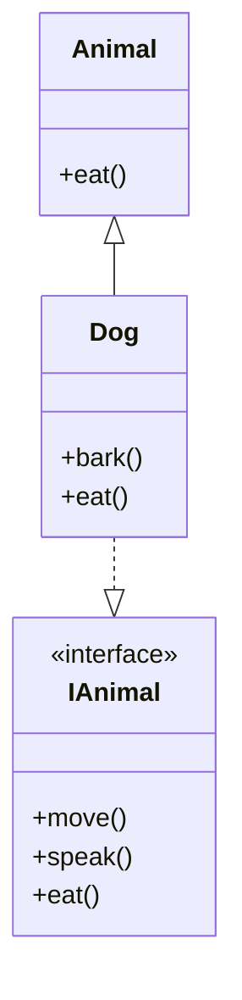

# Understanding Generalization: Classes, Subtypes, and Interfaces

<Image src="/blog-post-complexity.png" width="718" height="404" alt="Generalization in OOP" />

Generalization is the backbone of flexible software design. It's how we model relationships between types, share behavior, and enable polymorphism. Let's break down what it really means in practice.

---

## What is a Class?

A **class** defines a type for its objects — describing what they can do through public methods and what data they hold through attributes. For example:

```java
public class Dog {
    public void bark() { System.out.println("Woof!"); }
}

Dog fido = new Dog();
fido.bark(); // Woof!
```

A `Dog` object is dog-typed. It can do dog things, as defined by its class.

---

## Subtypes and Inheritance

Often, we want to model relationships: a `Dog` is an `Animal`. This is **subtyping** — a dog behaves like a dog, but also like an animal. In Java, this is done with inheritance:

```java
public class Animal {
    public void eat() { System.out.println("Nom nom"); }
}

public class Dog extends Animal {
    public void bark() { System.out.println("Woof!"); }
}

Dog fido = new Dog();
fido.eat(); // Nom nom
fido.bark(); // Woof!
```

The `Dog` class **inherits** methods and attributes from `Animal`. This is classic implementation inheritance: code reuse and behavioral sharing.

---

## Interfaces: Behavior Without Implementation

But inheritance isn't the only way to express subtyping. Enter **interfaces**.

A Java interface declares method signatures — no implementation, no attributes. It's a contract for behavior:

```java
public interface IAnimal {
    void move();
    void speak();
    void eat();
}

public class Dog implements IAnimal {
    public void move() { System.out.println("Runs"); }
    public void speak() { System.out.println("Woof!"); }
    public void eat() { System.out.println("Nom nom"); }
}
```

A class that implements an interface promises to provide all those behaviors. Unlike inheritance, interfaces don't share code — just expectations.

---

## UML: Visualizing Generalization and Interfaces

In **UML Class Diagrams**:

- **Inheritance** (generalization) is a solid line with a hollow arrowhead pointing to the parent class.
- **Interfaces** are shown with guillemets («interface») and a dotted arrow from the implementing class to the interface.



---

## Why Use Interfaces?

- **Polymorphism**: Different classes can implement the same interface differently. `Dog` barks, `Cat` meows, but both implement `IAnimal`.
- **Multiple Inheritance**: Java disallows multiple class inheritance, but a class can implement multiple interfaces.
- **Flexibility**: Interfaces describe _what_ should be done, not _how_. This decouples code and enables reusable, testable designs.

---

## Practical Advice

- Use **inheritance** for shared implementation, but prefer **composition** and **interfaces** for flexibility.
- Design interfaces around behaviors, not data.
- Don't overuse inheritance — it tightly couples classes and can make code brittle.
- Use interfaces to enable polymorphism and future-proof your code.
- In complex systems, interfaces let related classes work together consistently while allowing different implementations.

---

**How do you use generalization and interfaces in your designs? What's the best or worst inheritance hierarchy you've seen? Share your stories below.**
