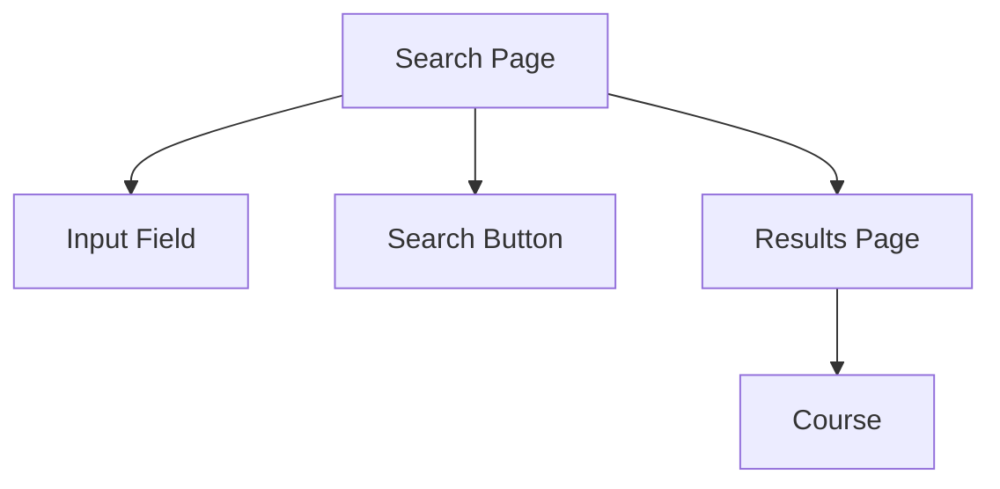
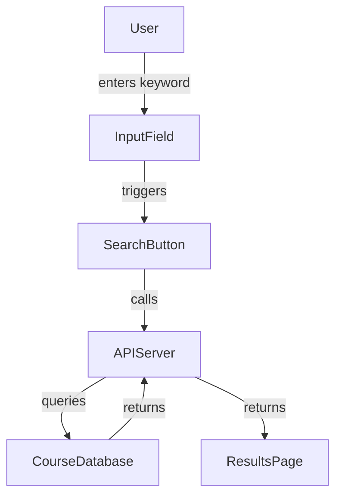

# Requirements, Conceptual Design, and Technical Design: No-Fluff Guide

## 1. Requirements Gathering (Elicitation)

- Don't code before you know what to build.
- Ask probing questions, not just what's stated. (e.g., "No kitchen?" "Room sizes?" "External constraints?")
- Clarify ambiguities and missing info.
- **House Example:**
  - "Do you want a kitchen?"
  - "How big should the gym be?"
  - "Any building codes?"
- **Software Example:**
  - "What does 'search for courses' mean?"
  - "What filters?"
  - "What's a 'relevant' course?"

## 2. Conceptual Design

- Sketch the big pieces and their responsibilities, ignore implementation.
- **Components** = major parts (house: kitchen, gym; software: search page, course, input field).
- **Connections** = how components interact (living room connects to kitchen; search page connects to input field, results page).
- **Responsibilities** = what each part does (kitchen: meal prep; search page: search courses).
- Use mockups (hand-drawn or digital) to visualize.
- Don't specify tech details (no wiring, no database schema yet).

**Example (Course Search):**



## 3. Technical Design

- Break down each component into smaller, implementable parts.
- Add technical details: how will each responsibility be fulfilled?
- **House:** Gym needs reinforced floor → design beams/columns.
- **Software:** Search page needs to query a course database → define API, data flow, error handling.
- Use technical diagrams (UML, flowcharts, etc.) to specify structure and behavior.
- Identify and resolve conflicts (e.g., gym floor reinforcement vs. open basement).

**Example (Course Search, Technical):**

```typescript
// SearchPage.tsx
const handleSearch = async (keyword: string) => {
  const results = await fetch(`/api/courses?query=${encodeURIComponent(keyword)}`).then(res =>
    res.json()
  )
  setResults(results)
}
```



## 4. Iteration & Feedback

- Constantly check with stakeholders (client, users) to validate both conceptual and technical designs.
- Be ready to revise requirements and designs as new info or constraints emerge.

---

## Actionable Takeaways

- Never skip requirements. Ask "what's missing?" and "what if?" questions.
- Draw conceptual mockups before any code or tech diagrams.
- Only after the conceptual design is clear, break it down into technical details.
- Use diagrams and sketches to communicate, not just text.
- Iterate: requirements ↔ conceptual design ↔ technical design, until all are solid.

## Contrarian/Speculative

- For small projects, you can sometimes merge conceptual and technical design, but always do _some_ requirements elicitation.
- For rapid prototyping, use "just enough" design, but document assumptions so you can refactor later.

---

**Summary:**
You wanted a direct, code-level, and example-driven explanation of the importance and process of requirements gathering, conceptual design, and technical design, using both the house and course search website analogies, with actionable steps and no high-level fluff.
